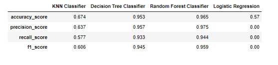

# 1. Ensaio de Machine Learning 

O objetivo desse projeto é realizar o ensaio dos parâmetros que controlam o overffiting de algoritmos de Machine Learning.

Projeto desenvolvido para a conclusão da disciplina de Fundamentos de Machine Learning da Comunidade DS

# 2.	Problema de negócio

### 2.1 Descrição
 A empresa Data Money acredita que a expertise no treinamento e ajuste fino dos algoritmos, feito pelos Cientistas de Dados da empresa, é a principal motivo dos ótimos resultados que as consultorias vêm entregando aos seus clientes
 
### 2.2 Objetivo
 O objetivo desse projeto será realizar ensaios com algoritmos de Classificação, Regressão e Clusterização em datasets determinados a fim de acompanhar alterações na performance dos algoritmos à medida que os parâmetros de treinamento vão sendo modificados. 

# 3.	Planejamento da solução

### 3.1	Produto final
O produto final será 7 tabelas mostrando a performance dos algoritmos avaliados usando múltiplas métricas para 3 conjuntos de dados diferentes: treinamento, validação e teste.

### 3.2	Algoritmos ensaiados

### Classificação 

Algoritmos: KNN, Decision Tree, Random Forest e Logistic Regression

Métricas de performance: Accuracy, Precision, Recall e F1-Score

### Regressão

Algoritmos: Linear Regression, Decision Tree Regressor, Random Forest Regressor, Polinomial Regression, Linear Regression Lasso, Linear Regression Ridge, Linear Regression Elastic Net, Polinomial Regression Lasso, Polinomial Regression Ridge e Polinomial Regression Elastic Net.

Métricas de performance: R2, MSE, RMSE, MAE e MAPE.

### Clusterização

Algoritmos: K-Means e Affinity Propagation.

Métricas de performance: Silhouette Score.

# 4.	Desenvolvimento

### 4.1	Estratégia da solução 
O projeto em questão foi desenvolvido utilizando linguagem de programação Python para treinar cada algoritmo, variar seus principais parâmetros e observar as métricas. O parâmetro ou combinação de parâmetros que obteve a melhor performance serão escolhidos para o treinamento final do algoritmo. 

### 4.2     O passo a passo

Passo 1: Divisão dos dados em treino, teste e validação.

Passo 2: Treinamento dos algoritmos com os dados de treinamento, utilizando os parâmetros “default”. 

Passo 3: Medir a performance dos algoritmos treinados com o parâmetro default, utilizando o conjunto de dados de treinamento.

Passo 4: Medir a performance dos algoritmos treinados com o parâmetro “default”, utilizando o conjunto de dados de validação. 

Passo 5: Treinar novamente o algoritmo nos dados de treinamento, alterando os valores dos principais parâmetros que controlam o overfitting. Avaliar a performance do modelo treinado nos dados de validação. Repetir esse processo até encontrar o conjunto de parâmetros que apresente a melhor performance sob os dados de validação. 

Passo 6: Unir os dados de treinamento e validação.

Passo 7: Retreinar o algoritmo com a união dos dados de treinamento e validação, utilizando os melhores valores para os parâmetros de controle do algoritmo.

Passo 8: Medir a performance dos algoritmos treinados com os melhores parâmetros, utilizando o conjunto de dados de teste. 

# 5.	Os top 3 insights

### 5.1	Insight 1

Nos dados de classificação, os algoritmos baseados em árvore, seja a Decision Tree Classifier ou a Random Forest Classifier, apresentaram a melhor performance dentre todos os algoritmos seja nos dados de validação, teste ou treinamento. Aqui destaca-se a versatilidade desses modelos, que podem ser destacados como uma das primeiras e melhores opções de algoritmo de Machine Learning a serem testados em um dataset novo.

### 5.2	Insight 2

Nos dados de regressão, os algoritmos polinomiais, especialmente o Polinomial Regression, apresentou um tempo de treinamento maior em relação aos demais algoritmos. Isto aconteceu quando o grau do polinômio foi aumentado no treinamento e à medida que aumentamos esse grau, o modelo apresentou incapacidade de generalizar a performance obtida para dados não antes vistos. 

Esse tempo maior de treinamento destacado acima se deve ao fato de que, à medida que incrementamos o grau do polinômio treinado, mais features vão sendo incluídas na equação polinomial e, portanto, aumenta a quantidade de  coeficientes (lineares, quadráticos, cúbicos, etc) e a quantidade de relações entre as variáveis. Em resumo, a equação polinomial resultante fica cada vez maior e mais complexa, o quê incrementa o tempo de processamento para treinar o algoritmo. 

### 5.3	Insight 3 

Nos dados de classificação, a Logistic Regression apresentou performance melhor à medida que o parâmetro que controla a força da regularização foi incrementado. Por outro lado, o risco aqui é de forçar uma regularização muito intensa que capture de forma sobremaneira intensa a relação entre os dados, obtendo uma performance interessante. Quando submetida a dados não vistos, o modelo pode não conseguir repetir essa mesma performance, resultando em overfitting.

# 6.	Resultados

### Ensaio de classificação 

### a)	Dados de treinamento

 

### b)	Dados de validação 
 

### c)	Dados de teste
 

### Ensaio de regressão 

### a)	Dados de treinamento

 

### b)	Dados de validação 
 

### c)	Dados de teste

 

### Ensaio de clusterização 

 

# 7.	Conclusão

Nesse projeto, foram implementados diversos algoritmos de Machine Learning e verificado a performance dos mesmos à medida que o ajuste dos parâmetros era feito. Acredito que o projeto é uma introdução a parte do que é feito por Cientistas de Dados que atuam na indústria diretamente e contribuiu para solidificar meu conhecimento no treinamento de diferentes modelos. 

O entendimento de que o profissional cientista de dados precisa equilibrar-se entre o overiffting e o underfitting do modelo fica como lição desse ensaio. A saber, regularizar com alta intensidade, não limitar o crescimento das árvores, aumentar intensamente o grau do polinômio treinado podem ser fatores que contribuem para o overfitting do modelo. Na contrapartida disso, ao escolher uma combinação de parâmetros que não fomente o aprendizado, podemos criar as condições para o não aprendizado genuíno.

Como continuidade a esse ensaio, pretendo aplicar algoritmos de Machine Learning em muitos outros projetos com contextos variados a fim de aprimorar meus conhecimentos.

